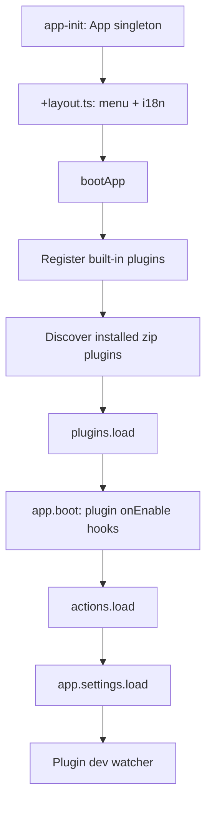

# Stream Kit Architecture

This document describes how the Stream Kit monorepo is organized and how the main runtime pieces fit together.

## Monorepo layout

| Package | Role |
| --- | --- |
| `@stream-kit/app` | SvelteKit + Tauri host, SQLite/Drizzle, app kernel |
| `@stream-kit/ui` | App-agnostic Svelte 5 UI primitives and declarative page blocks |
| `@stream-kit/core` | Shared plugin utilities (`parseCommand`, `interpolateVariables`, `getFieldValue`) |
| `@stream-kit/app-types` | Type-only re-exports of `@stream-kit/plugin` for plugin authors |
| `@stream-kit/plugin-*` | Built-in platform and feature plugins |

## Boot sequence



Built-in plugins register through `createCommandsPlugin()` and similar factories. Each plugin owns its lifecycle hooks:

- `onLoad` — hydrate plugin-owned state (e.g. commands from DB)
- `onEnable` — start runtime services (e.g. chat listeners)
- `onEnable` / `onDisable` — re-enable or tear down when toggled in the UI

## Plugin contract

Plugins export a factory:

```ts
const plugin: Plugin = (app) => ({
  name: 'My Plugin',
  triggers: [...],
  handlers: [...],
  menuItems: [...],
  settings: [...],
  customViews: { myView: MyPageComponent }, // built-in npm plugins only
  api: { ... },
  onLoad, onEnable, onReady, onDisable
});
```

### Extension points

| Extension | Built-in npm | External zip |
| --- | --- | --- |
| Triggers / handlers | Yes | Yes |
| Settings fields | Yes | Yes |
| Declarative menu pages (`PageBlocks`) | Yes | Yes |
| Custom Svelte views (`customViews`) | Yes | No |
| Plugin public API (`api`) | Yes | Yes |

External plugins load through Tauri (`plugins.rs`) and browser import maps pointing at `static/plugin-host/`.

Installed plugins can self-update when their manifest includes `updateManifestUrl`. The app fetches the remote manifest, compares semver, and downloads the zip from `downloadUrl`. See `docs/plugins/updates.md`.

## Actions vs Commands

- **Actions** — first-party app feature. Trigger → condition → handler rules stored in the `actions` table.
- **Bot / Commands** — owned by `@stream-kit/plugin-bot` (DB schema, domain, UI, chat runtime). Chat commands reuse the action handler system for execution but manage their own `commands` table. Timers and moderation rules use `bot_timers` and `bot_mod_rules`.

Chat messages matching `{prefix}{command}` are handled by the Bot plugin runtime. Platform plugins no longer expose a separate "Chat Command" action trigger.

## Database ownership

| Table | Owner |
| --- | --- |
| `actions` | App (`packages/app/src/db`) |
| `commands` | Bot plugin (`plugins/bot/src/commands/app/db`) |
| `bot_timers` | Bot plugin (`plugins/bot/src/timers/app/db`) |
| `bot_mod_rules` | Bot plugin (`plugins/bot/src/moderation/app/db`) |

Migrations for bot tables live in the plugin (`migrateBotTables`) and are invoked from the app migration runner during startup.

## Plugin DB API

`PluginAppApi.db.registerMigrations(pluginKey, migrations)` registers additional plugin migrations. Built-in commands currently migrate through a direct import in `packages/app/src/db/migrate.ts`; the registry is available for future external plugins.

## UI conventions

- Page shell: `<Container class="px-6 py-6" size="md">`
- Shared bulk selection: `createSelectableList()` in `$lib/components/core/list/`
- Settings and plugin settings both render through `SettingsFieldGroup`

## Type surface for plugin authors

- Runtime API: passed as the factory argument (`PluginAppApi`)
- Types: `@stream-kit/plugin` or `@stream-kit/app-types`
- Shared utilities: `@stream-kit/core`

Value imports from `@stream-kit/plugin` in external plugin bundles resolve to the empty plugin-host shim — use `import type` only in zip plugins.
