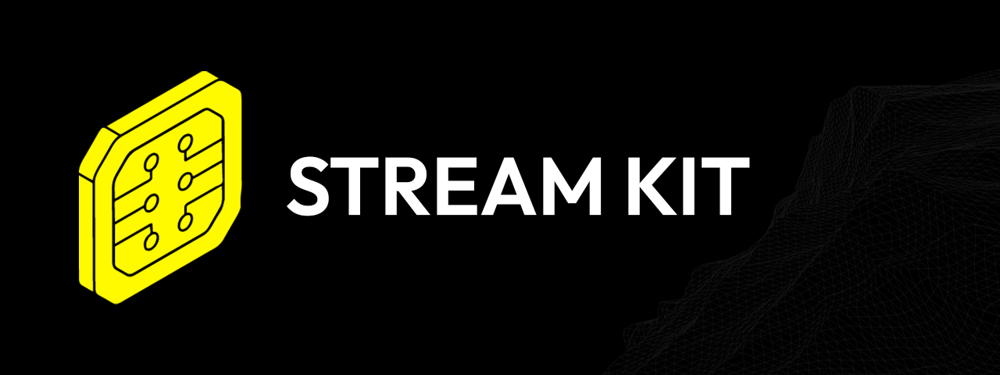

[](https://github.com/stream-kit-app/app)
[](#current-status)
[](#license)

> [!WARNING]
> **Work in progress**
>
> Stream Kit is in **active development**. Features, APIs, and the user interface may change at any time. Not everything described below is fully implemented or stable yet.
>
> Treat the app as an **experimental project** for now — not a production-ready tool.

**Stream Kit** is a desktop application for streamers who want to automate, extend, and personalize their live streams. The app combines a powerful **action system** (when X happens → do Y) with a **plugin architecture**, so you can connect and extend Twitch, YouTube, and other services without building everything yourself.

Think of Stream Kit as a central hub for stream automation: from chat reactions and TTS to moderation, polls, and channel points — all configurable through a visual interface.

## Table of contents

- [What can Stream Kit do?](#what-can-stream-kit-do)
    - [Actions](#actions--the-heart-of-the-app)
    - [Plugins](#plugins--platforms-and-extensions)
    - [Bot & commands](#bot--commands)
    - [Settings](#settings--internationalization)
- [Who is this for?](#who-is-this-for)
- [Tech stack](#tech-stack)
- [Project structure](#project-structure)
- [Getting started](#getting-started)
- [Current status](#current-status)
- [License](#license)

## What can Stream Kit do?

### Actions — the heart of the app

Actions are rules you compose yourself. Each action consists of three parts:

| Part           | Description            | Examples                                                              |
| -------------- | ---------------------- | --------------------------------------------------------------------- |
| **Triggers**   | When something happens | Chat message, follow, channel point redemption, stream online/offline |
| **Conditions** | Optional filters       | Username contains X, message starts with Y, role is moderator         |
| **Handlers**   | What should happen     | Send message, delete message, play TTS, start a poll                  |

Actions are grouped, stored in a local database, and activated automatically when the app is running. Manage them from the **Actions** page.

### Plugins — platforms and extensions

Stream Kit is built around plugins. Each plugin can register triggers, handlers, settings, and its own API.

#### Built-in plugins

| Plugin                          | Status         | Description                                                                                  |
| ------------------------------- | -------------- | -------------------------------------------------------------------------------------------- |
| [**Handlers**](plugins/core/) | In development | Audio playback and custom script handlers                                                    |
| [**Bot**](plugins/bot/) | In development | Chat bot: commands, timers, moderation, built-in commands |
| [**Twitch**](plugins/twitch/)   | In development | OAuth, EventSub, chat, moderation, polls, predictions, raids, subs, channel points, and more |
| [**YouTube**](plugins/youtube/) | In development | Live chat, memberships, super chats/stickers, moderation, and stream status                  |
| [**TTS**](plugins/tts/)         | In development | Text-to-speech via StreamElements or ElevenLabs                                              |

#### External plugins

You can also install **external plugins** as `.zip` files from the Plugins page.

> [!TIP]
> Want to build your own plugin? Use the [plugin template](packages/plugin-template/) as a starting point. It includes instructions for development, packaging, and installation.

### Bot & commands

Chat bot features are managed by the **Bot** plugin (`@stream-kit/plugin-bot`): custom commands, timers, moderation, and built-in system commands. Open **Bot** in the sidebar (Overview, Commands, Timers, Moderation).

Use **Actions** for event-driven automation (triggers, conditions, handlers). Use **Bot → Commands** for chat-triggered shortcuts with their own handler lists.

> [!NOTE]
> Connect Twitch or YouTube from the **Plugins** page before chat commands can listen in your channel.

### Settings & internationalization

- Language — Dutch and English, more to be added later ..
- Appearance settings
- **Developer mode** with plugin hot-reload for plugin developers

## Who is this for?

| Audience        | What Stream Kit offers                                                                             |
| --------------- | -------------------------------------------------------------------------------------------------- |
| **Streamers**   | More control over chat, automations, and interactions — without complex scripts or scattered tools |
| **Power users** | Conditional logic: if this and that, then that                                                     |
| **Developers**  | Build and share custom plugins with the community                                                  |

The goal is not to replace existing tools one-to-one, but to provide an **open, extensible foundation** you can shape to your needs.

## Tech stack

| Layer              | Technology                                                         |
| ------------------ | ------------------------------------------------------------------ |
| Desktop shell      | [Tauri 2](https://tauri.app/) (Rust)                               |
| Frontend           | [SvelteKit](https://svelte.dev/) + [Svelte 5](https://svelte.dev/) |
| Styling            | [Tailwind CSS 4](https://tailwindcss.com/)                         |
| UI primitives      | [bits-ui](https://bits-ui.com/)                                    |
| Database           | SQLite via Tauri SQL + Drizzle ORM                                 |
| Package management | [pnpm](https://pnpm.io/) workspaces (monorepo)                     |
| Plugins            | Isolated JS bundles with a fixed API contract                      |

## Project structure

```
stream-kit/
├── packages/
│   ├── app/              # Main application (SvelteKit + Tauri)
│   ├── core/             # Shared utilities (e.g. variable interpolation)
│   ├── ui/               # Shared UI primitives
│   ├── app-types/        # Type-only exports for plugin authors
│   └── plugin-template/  # Template for external plugins
├── plugins/
│   ├── core/             # Handlers plugin (audio, scripts) — npm: @stream-kit/plugin-handlers
│   ├── commands/         # Chat commands plugin
│   ├── twitch/           # Twitch plugin
│   ├── youtube/          # YouTube plugin
│   └── tts/              # Text-to-speech plugin
└── package.json          # Workspace root scripts
```

## Getting started

### Prerequisites

- [Node.js](https://nodejs.org/) — LTS recommended
- [pnpm](https://pnpm.io/installation)
- [Rust](https://www.rust-lang.org/tools/install) — required for Tauri
- Platform-specific Tauri dependencies — see [Tauri prerequisites](https://v2.tauri.app/start/prerequisites/)

### Installation

```bash
# Install dependencies
pnpm install

# Start the dev environment (builds packages, starts watchers + Tauri)
pnpm run dev
```

<details>
<summary><strong>Other scripts</strong></summary>

```bash
pnpm run build          # Production build
pnpm run check          # Typecheck across the workspace
pnpm run lint           # Linting & formatting check
pnpm run format         # Format code
pnpm run dev:app        # Start the app only (without package watchers)
pnpm run dev:packages   # Run packages/plugins in watch mode only
```

</details>

### Recommended IDE setup

[VS Code](https://code.visualstudio.com/) with the following extensions:

| Extension                                                                                    | Purpose                    |
| -------------------------------------------------------------------------------------------- | -------------------------- |
| [Svelte](https://marketplace.visualstudio.com/items?itemName=svelte.svelte-vscode)           | Svelte & SvelteKit support |
| [Tauri](https://marketplace.visualstudio.com/items?itemName=tauri-apps.tauri-vscode)         | Tauri CLI & debugging      |
| [rust-analyzer](https://marketplace.visualstudio.com/items?itemName=rust-lang.rust-analyzer) | Rust language server       |

## Current status

> [!CAUTION]
> Stream Kit is at version **0.1.0**. The limitations below apply until a stable release is available.

| Topic             | Status                                                                       |
| ----------------- | ---------------------------------------------------------------------------- |
| Stable release    | Not yet available — APIs, database schemas, and UI may break between commits |
| Plugin coverage   | Not all triggers and handlers are complete; plugins are still being expanded |
| YouTube plugin    | Recently added, still in active development                                  |
| Bot functionality | Bot plugin: commands, timers, moderation, built-in commands |
| Documentation     | Minimal — this README and the plugin template README are the starting point  |
| Distribution      | No public installer or release channel yet                                   |

> [!IMPORTANT]
> Contributions, feedback, and experimentation are welcome. Keep in mind the experimental nature of the project.

## License

[Source Available](LICENSE) — the source code is publicly visible for human reference only. It may not be used, distributed, scraped, or processed by automated systems or AI tools. See [LICENSE](LICENSE) and [robots.txt](robots.txt).
