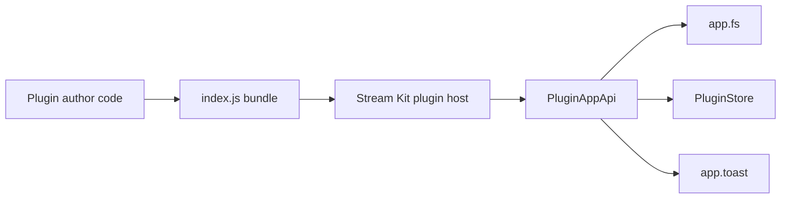

# Plugin getting started

This guide walks you through creating your first Stream Kit plugin from the template through local development and distribution.

For the full API reference, see [Plugin authoring API](/docs/developers/plugin-api). For installing plugins as a user, see [Installing plugins](/docs/developers/installing-plugins).

## What you build

A Stream Kit plugin is:

1. A `manifest.json` with a stable `key`
2. A single ESM entry file (`dist/index.js`) that default-exports a `Plugin` function
3. Optional handlers, triggers, menu pages, settings, and lifecycle hooks

At runtime the app loads your bundle and calls your plugin with a `PluginAppApi` instance (`app`).



## Step 1 — Use the template

Create a new repository from the [plugin-starter](https://github.com/stream-kit-app/plugin-starter/generate) GitHub template, or clone it manually:

```bash
gh repo create my-stream-kit-plugin --template stream-kit-app/plugin-starter --public
```

Install dependencies:

```bash
pnpm install
```

Start from [`src/minimal.ts`](https://github.com/stream-kit-app/plugin-starter/blob/main/src/minimal.ts) for a short example, or use [`src/index.ts`](https://github.com/stream-kit-app/plugin-starter/blob/main/src/index.ts) when you need the full declarative page block showcase.

Add the SDK packages as dev dependencies (included in the template):

```bash
pnpm add -D @stream-kit/plugin
pnpm add @stream-kit/core
```

For custom Svelte views or dashboard widgets (built-in-style plugins only), also add:

```bash
pnpm add -D @stream-kit/ui
```

Zip plugins that use declarative page blocks only do not need `@stream-kit/ui`.

> **Monorepo contributors:** The same template source lives in [`packages/plugin-template/`](../../packages/plugin-template/) for internal development inside the Stream Kit repository.

Update `manifest.json`:

```json
{
	"key": "hello-world",
	"name": "Hello World",
	"version": "0.1.0",
	"entry": "dist/index.js"
}
```

Rules for `key`:

- Lowercase letters, numbers, and hyphens only
- Used for install paths, settings files, and handler/trigger IDs
- Do not change it after release without a migration plan

## Step 2 — Write the plugin entry

```ts
import type { Plugin } from '@stream-kit/plugin';

import { createGreetHandler } from './handler/greet';

const plugin: Plugin = (app) => ({
	name: 'Hello World',
	description: 'My first plugin',
	icon: 'ri:hand-heart-line',
	handlers: [createGreetHandler()],
	onEnable: () => {
		app.toast.create({
			title: 'Hello World',
			description: 'Plugin enabled',
			variant: 'success'
		});
	}
});

export default plugin;
```

The `Plugin` function receives `app` once at registration time. Return handlers, triggers, `menuItems`, `settings`, and lifecycle hooks from that function.

### Persist settings with PluginStore

Most plugins store configuration in the lifecycle `store` (`plugin.{key}.json`):

```ts
onLoad: async ({ store }) => {
	const saved = await store.get<MySettings>('settings');
	if (saved) applySettings(saved);
},
onSave: async ({ store }) => {
	await store.set('settings', getSnapshot());
}
```

You do not need SQLite unless you have a specific reason to use `app.db`.

## Step 3 — Build and externalize host modules

Plugins bundle to one ESM file. **Do not bundle** modules the app provides at runtime:

```ts
external: [
	'@stream-kit/plugin',
	'@stream-kit/plugin/action',
	'@stream-kit/core',
	'svelte',
	'@stream-kit/ui',
	'bits-ui',
	'runed',
	'@iconify/svelte'
]
```

In the monorepo, use the shared Vite config from [`plugins/create-vite-build-config.js`](../../plugins/create-vite-build-config.js). Standalone projects use the bundled `vite.build.config.js` from the plugin-starter template.

Build output:

```text
dist/
└── index.js
```

## Step 4 — Run locally in Stream Kit

1. Start Stream Kit (desktop app)
2. Build your plugin in watch mode: `pnpm dev`
3. Link the plugin:
   - Open **Plugins**, enable **Developer mode** in Settings
   - Click **Link dev plugin** and select your `manifest.json`
4. Enable the plugin on the Plugins page
5. Enable **Dev mode** on the plugin card

When `dist/index.js` rebuilds, the app mirrors the output and reloads the plugin.

First-party plugins listed in [`dev-plugins.json`](../../dev-plugins.json) are linked automatically during monorepo development.

## Step 5 — Package and distribute

Create a zip:

```bash
pnpm package
```

Zip layout:

```text
plugin.zip
├── manifest.json
└── dist/
    └── index.js
```

Users install the zip from the **Plugins** page. See [Installing plugins](/docs/developers/installing-plugins) for the user flow; publish `updateManifestUrl` in your manifest for self-hosted updates.

## Import conventions

| Need | Import from | Example |
|------|-------------|---------|
| Types (`Plugin`, `PluginAppApi`, handlers, triggers) | `@stream-kit/plugin` | `import type { Plugin } from '@stream-kit/plugin'` |
| Runtime helpers | `@stream-kit/core` | `import { getFieldValue } from '@stream-kit/core'` |
| `BaseDirectory`, `SeekMode` | `@stream-kit/plugin` | `import { BaseDirectory } from '@stream-kit/plugin'` |
| Svelte UI (custom views/widgets only) | `@stream-kit/ui` | `import { Button } from '@stream-kit/ui/button'` |
| Platform APIs | `app` parameter | `app.fs.readTextFile(...)`, `app.toast.create(...)` |

**Never** import `@tauri-apps/*` in plugin code. The app owns all platform logic.

`@stream-kit/plugin` types come from the published `dist/index.d.ts`. At runtime the app resolves `@stream-kit/plugin` to `/plugin-host/plugin.js` through the import map.

## IDE hover and autocomplete

API documentation is embedded as JSDoc in `@stream-kit/plugin` and `@stream-kit/core`. Use `import type` for types and hover on `app.` methods, `getFieldValue`, `BaseDirectory.AppData`, and handler field definitions to see descriptions and examples in your editor.

## Filesystem (`app.fs`)

Use `app.fs` for reading and writing files. Paths are usually **relative** to a `BaseDirectory`:

```ts
import { BaseDirectory } from '@stream-kit/plugin';

await app.fs.mkdir('logs', { baseDir: BaseDirectory.AppData, recursive: true });

await app.fs.writeTextFile('logs/events.log', `${line}\n`, {
	baseDir: BaseDirectory.AppData,
	append: true
});

const exists = await app.fs.exists('logs/events.log', {
	baseDir: BaseDirectory.AppData
});
```

Common directories:

| `BaseDirectory` | Typical use |
|-----------------|-------------|
| `AppData` | Plugin-owned data under the app data folder |
| `AppConfig` | Configuration files |
| `AppCache` | Cache or temporary derived files |
| `Resource` | Bundled app resources |

For native file pickers, use `app.fs.select({ type: 'file' | 'folder', filters?: [...] })`. For a save dialog, use `app.fs.save({ defaultPath?, filters? })`.

To work with a file handle:

```ts
const file = await app.fs.open('data.bin', {
	read: true,
	baseDir: BaseDirectory.AppData
});

try {
	const buffer = new Uint8Array(1024);
	await file.read(buffer);
} finally {
	await file.close();
}
```

## Zip plugins vs built-in plugins

| Feature | Zip / external plugin | Built-in monorepo plugin |
|---------|----------------------|--------------------------|
| Declarative menu pages (blocks) | Yes | Yes |
| Handlers and triggers | Yes | Yes |
| `PluginStore` | Yes | Yes |
| Custom Svelte views (`customViews`) | No | Yes |
| Svelte in menu page content | No | Yes (built-in only) |

Zip plugins should use declarative page blocks (`text`, `form`, `button`, `card`, …). Button blocks may define `onClick` for plugin-owned behavior.

## Next steps

- [Plugin authoring API](/docs/developers/plugin-api) — full contract, lifecycle hooks, widgets, i18n
- [Installing plugins](/docs/developers/installing-plugins) — zip install from the Plugins page
- [@stream-kit/plugin on npm](https://www.npmjs.com/package/@stream-kit/plugin) — types and API contract
- [@stream-kit/ui on npm](https://www.npmjs.com/package/@stream-kit/ui) — Svelte UI primitives for custom views (optional)
- [Plugin starter template](https://github.com/stream-kit-app/plugin-starter) — GitHub template repository
