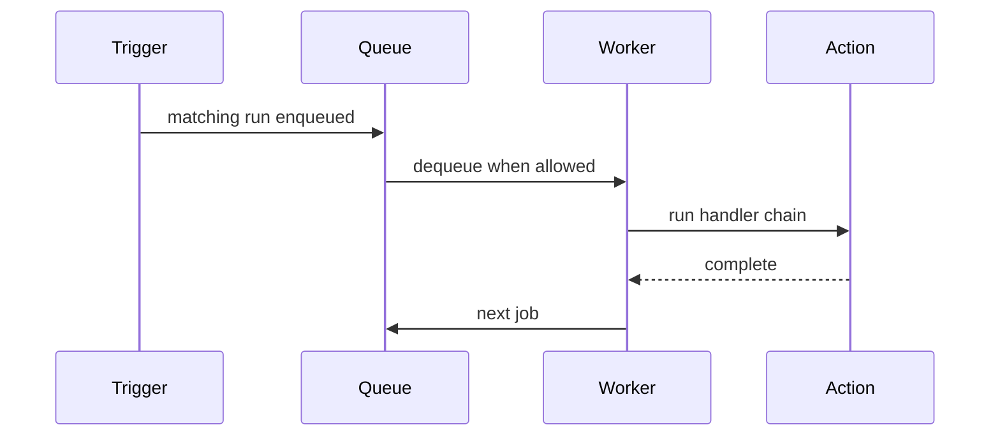

# Action Queues

Action queues control **when** handler chains run after a trigger matches. They do not delay condition checks — only execution is queued.

## Without a queue

Actions set to **No queue** run **immediately and in parallel** whenever a trigger fires. This is the default behavior for overlapping events (multiple chat messages, rapid alerts).

## With a queue

When an action is assigned to a queue, each matching run becomes a **job** in that queue. A per-queue worker starts jobs according to queue settings.

Open **Queues** in the sidebar to manage queues and watch pending/running jobs.

## Default queue

On first boot Stream Kit creates a **default** queue. New actions are assigned to it automatically. The default queue cannot be deleted; removing another queue moves its actions to **default**.

You can still set **No queue** on any action for parallel execution.

## Queue settings

| Setting | Description |
| --- | --- |
| **Name** | Shown in the action editor and Queues page |
| **Blocking** | When enabled, only **one** job runs at a time (FIFO). When disabled, jobs start immediately and can overlap |
| **Max length** | Optional cap on pending jobs. When full, new runs are **dropped** and logged |

### Blocking vs non-blocking

| Mode | Behavior |
| --- | --- |
| **Blocking** | Strict FIFO — ideal for TTS, single audio device, one overlay animation at a time |
| **Non-blocking** | Jobs dequeue quickly but may run in parallel — use when you only need light ordering |

## Queue controls

On the **Queues** page:

- **Pause** — hold pending jobs (running job finishes)
- **Resume** — continue dequeuing
- **Clear** — discard pending jobs

Handlers **Pause Queue**, **Resume Queue**, and **Toggle Queue** can do the same from an action. See [Core queue handlers](/docs/api/handlers/core).

## Queue status triggers

React to queue lifecycle with Core triggers (IDs under `core:core:queue:*`):

- Queue paused / resumed
- Queue idle
- Job enqueued / started / completed

Browse [Core triggers](/docs/api/triggers/core).

## Testing vs production

The action editor **Test** button **bypasses the queue** and runs immediately. Live trigger fires respect the queue.

## Persistence

Queue **definitions** and action assignments are stored in the database. **Pending jobs** are in memory only — they are lost on app restart.

## When to use a queue

| Use a queue | Skip the queue |
| --- | --- |
| TTS / audio playback | Instant chat replies |
| Sequential alert animations | Independent moderation actions |
| Single shared OBS transition | Parallel point redemptions with separate logic |

## Assigning queues

- Per action: **Queue** field in the editor
- Bulk: select actions on the Actions page → **Assign to queue**

## Related

- [Actions](/docs/guide/actions)
- [Core queue handlers](/docs/api/handlers/core)
